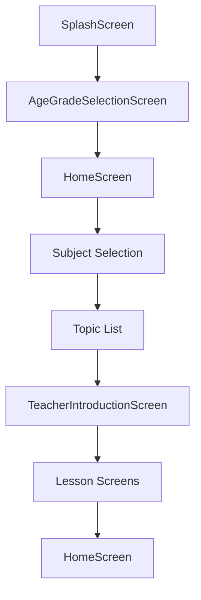
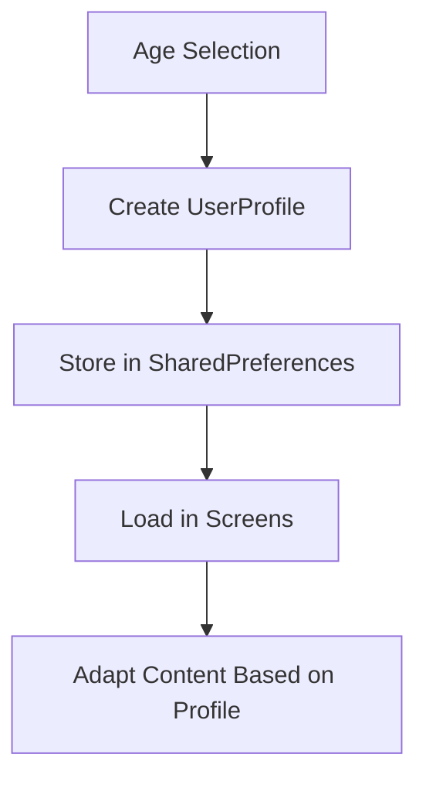
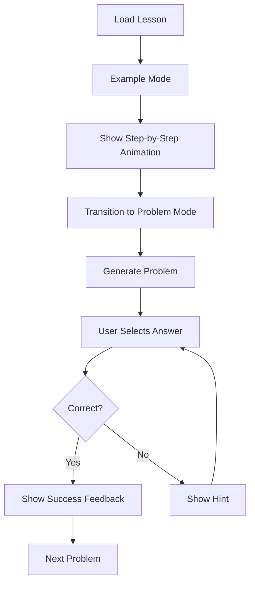
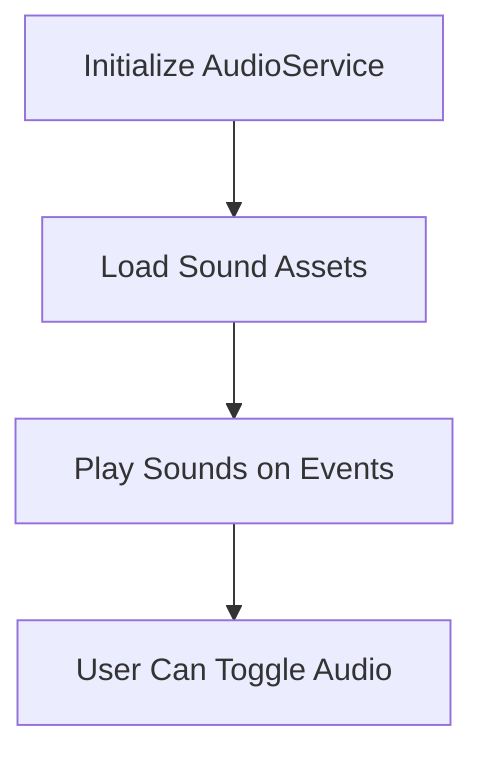

# System Patterns: BrightMind Adaptive Learning App

## Architecture Overview

The BrightMind app follows a component-based architecture using Flutter's widget system. The application is structured into several key layers:

```
App Architecture
├── Screens (Full-page UI components)
├── Widgets (Reusable UI components)
├── Models (Data structures)
├── Utils (Helper functions and services)
└── Assets (External resources)
```

## Navigation Flow

The application follows a hierarchical navigation pattern:



## Key Design Patterns

### 1. Widget Composition Pattern
The UI is built using composable widgets that can be combined to create complex interfaces. This promotes reusability and maintainability.

**Example**: The `BasicMathLessonScreen` composes several smaller widgets:
- `AnimatedMascot`
- `ExampleAnimationDisplay`
- `MathProblemDisplay`
- `InteractiveCountingArea`
- `AnswerOptionButton`

### 2. State Management
The app uses Flutter's built-in `StatefulWidget` pattern for local state management. Each screen manages its own state, including:
- UI state (animations, visibility)
- User interaction state (selected answers, attempts)
- Business logic state (problem generation, scoring)

**Example**: The `_BasicMathLessonScreenState` class manages:
- Animation controllers and animations
- Problem state (numbers, operations, answers)
- User interaction state (selected answers, feedback)

### 3. Service Pattern
Utility services are implemented as singleton classes that provide functionality across the app.

**Example**: The `AudioService` provides methods for playing sounds throughout the app:
- `initialize()` - Sets up the audio player
- `playSound(String soundName)` - Plays a specific sound
- `dispose()` - Cleans up resources

### 4. Adaptive UI Pattern
The UI adapts based on user characteristics (age, grade level) to provide an appropriate experience.

**Example**: Different UI approaches for:
- Young children (4-7): Larger buttons, more animations, simpler layouts
- Older children (8-16): More detailed content, organized layouts, advanced interactions

### 5. Factory Method Pattern
Used for creating objects based on parameters.

**Example**: `UserProfile.fromAge()` and `UserProfile.fromJson()` factory methods create user profiles from different inputs.

## Component Relationships

### Screen Components

1. **SplashScreen**
   - Purpose: App entry point, branding
   - Key Features: Animated logo, loading indicators
   - Transitions to: AgeGradeSelectionScreen

2. **AgeGradeSelectionScreen**
   - Purpose: User profile creation
   - Key Features: Age buttons, grade selection
   - Transitions to: HomeScreen
   - Components: AgeButton, GradeButton

3. **HomeScreen**
   - Purpose: Main navigation hub
   - Key Features: Subject selection, progress overview
   - Transitions to: Various subject/topic screens
   - Adapts based on: User age/grade

4. **TeacherIntroductionScreen**
   - Purpose: Introduce lesson topics
   - Key Features: Animated teacher character, topic preview
   - Transitions to: Lesson screens

5. **BasicMathLessonScreen**
   - Purpose: Teach math concepts through examples and problems
   - Key Features: Example mode, problem mode, interactive elements
   - Components: Multiple specialized widgets

### Widget Components

1. **AnimatedMascot**
   - Purpose: Character guide for users
   - States: idle, thinking, happy, waving
   - Features: Speech bubble, animations

2. **ExampleAnimationDisplay**
   - Purpose: Show animated examples of math operations
   - Features: Step-by-step visualization of math concepts

3. **MathProblemDisplay**
   - Purpose: Show math problems visually
   - Features: Number display, operation symbols, visual objects

4. **InteractiveCountingArea**
   - Purpose: Allow users to interact with countable objects
   - Features: Tappable objects, counting animations

5. **AnswerOptionButton**
   - Purpose: Multiple choice answer selection
   - States: normal, selected, correct, incorrect
   - Features: Visual feedback on selection

## Critical Implementation Paths

### 1. User Profile Flow


### 2. Math Lesson Flow


### 3. Audio System Flow


## Technical Decisions

### 1. Widget Granularity
Decision: Create specialized widgets for specific UI components rather than building monolithic screens.
Rationale: Improves maintainability, reusability, and testability.

### 2. Animation Management
Decision: Use explicit AnimationController instances rather than implicit animations.
Rationale: Provides fine-grained control over complex, multi-step animations.

### 3. State Management Approach
Decision: Use StatefulWidget for screen-level state management.
Rationale: Appropriate for the current app complexity; can be refactored to a more robust solution if needed.

### 4. User Profile Storage
Decision: Use SharedPreferences for storing user profile data.
Rationale: Simple, persistent storage solution appropriate for the limited user data needed.

### 5. Audio Implementation
Decision: Use the audioplayers package for sound effects.
Rationale: Provides cross-platform audio support with good performance.

## Future Architecture Considerations

1. **State Management Evolution**: Consider adopting a more robust state management solution (Provider, Bloc, Riverpod) as the app grows.

2. **Backend Integration**: Prepare for potential cloud backend integration for user data synchronization and content updates.

3. **Modularization**: Further modularize the app into feature packages as more subjects and lesson types are added.

4. **Accessibility**: Enhance the architecture to better support accessibility features.

5. **Testing Infrastructure**: Develop a comprehensive testing strategy including unit, widget, and integration tests.
